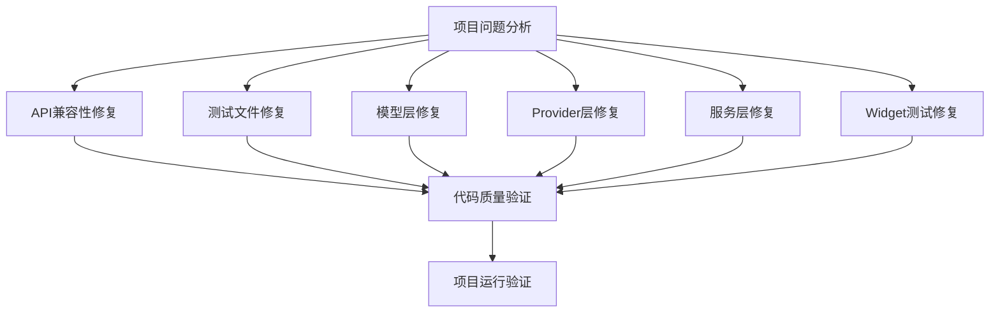
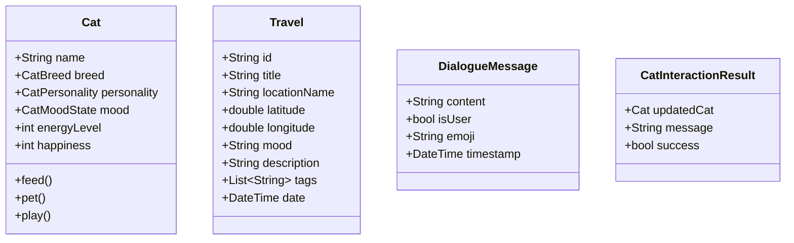

# 项目修复设计文档

## 概述

本设计文档详细说明了修复cuddle_cat Flutter项目中编译错误、API不匹配和代码质量问题的技术方案。修复工作将分为六个主要模块，每个模块解决特定类型的问题。

## 架构

### 修复策略架构



### 修复优先级

1. **高优先级**: API兼容性问题（影响编译）
2. **中优先级**: 模型和服务层API不匹配（影响功能）
3. **低优先级**: 测试文件修复（影响测试覆盖率）

## 组件和接口

### 1. API兼容性修复模块

#### 目标文件
- `lib/screens/profile_screen.dart`
- 其他可能包含`withValues`的文件

#### 修复策略
```dart
// 修复前
color: Colors.white.withValues(alpha: 0.9)

// 修复后  
color: Colors.white.withOpacity(0.9)
```

#### 实现方法
- 使用正则表达式搜索所有`.withValues(alpha: x)`模式
- 替换为`.withOpacity(x)`
- 验证修复后无编译警告

### 2. 模型层修复模块

#### Cat模型修复
当前问题：测试中使用了不存在的构造函数参数

```dart
// 当前Cat构造函数（正确）
Cat({
  required this.name,
  required this.breed,
  this.personality = CatPersonality.playful,
  // ... 其他参数
})

// 测试中错误使用的参数需要修复
// 错误: id, color, health, energy, hunger, lastInteraction
// 正确: name, breed, personality, mood, etc.
```

#### Travel模型修复
当前问题：测试中缺少必需参数

```dart
// Travel构造函数要求的参数
Travel({
  required this.id,
  required this.title,
  required this.locationName,  // 测试中缺少
  required this.latitude,
  required this.longitude,
  required this.mood,          // 测试中缺少
  required this.description,
  required this.tags,
  required this.photos,
  required this.date,
  this.isFavorite = false,
})
```

#### DialogueMessage模型
需要创建或修复DialogueMessage类以匹配ChatBubble的期望

```dart
class DialogueMessage {
  final String content;
  final bool isUser;
  final String? emoji;
  final DateTime timestamp;
  
  DialogueMessage({
    required this.content,
    required this.isUser,
    this.emoji,
    DateTime? timestamp,
  }) : timestamp = timestamp ?? DateTime.now();
}
```

### 3. Provider层修复模块

#### CatProvider修复
需要添加的方法和属性：

```dart
class CatProvider extends BaseProvider {
  Cat? _currentCat;
  
  // 需要添加的getter
  Cat? get currentCat => _currentCat;
  
  // 需要添加的方法
  void updateCatFromData(Cat cat) {
    _currentCat = cat;
    notifyListeners();
  }
}
```

#### TravelProvider修复
需要添加的方法：

```dart
class TravelProvider extends BaseProvider {
  Travel? _selectedTravel;
  
  // 需要添加的getter和方法
  Travel? get selectedTravel => _selectedTravel;
  
  void selectTravel(String id) {
    _selectedTravel = _records.firstWhere((r) => r.id == id);
    notifyListeners();
  }
  
  void clearSelection() {
    _selectedTravel = null;
    notifyListeners();
  }
  
  Future<void> addTravel(Travel travel) async {
    await addRecord(travel); // 使用现有的addRecord方法
  }
  
  List<Travel> getTravelsByLocation(String location) {
    return searchByLocation(location); // 使用现有方法
  }
  
  List<Travel> getTravelsSortedByDate() {
    return sortedRecords; // 使用现有属性
  }
  
  Future<void> loadTravels() async {
    await loadRecords(); // 使用现有方法
  }
  
  TravelStats getTravelStatistics() {
    return stats; // 使用现有属性
  }
}
```

### 4. 服务层修复模块

#### AIService修复
需要添加的方法：

```dart
class AIService {
  // 需要添加的方法
  Future<String> generateResponse(Cat cat, String userMessage) async {
    // 实现AI响应生成逻辑
    return "AI响应内容";
  }
  
  Future<String> analyzeEmotion(String message) async {
    // 实现情感分析逻辑
    return "happy"; // 或其他情感状态
  }
}
```

#### CatService修复
需要添加的方法：

```dart
class CatService {
  // 需要添加的方法
  Future<Cat> feedCat(Cat cat) async {
    cat.feed();
    return cat;
  }
  
  Future<Cat> petCat(Cat cat) async {
    cat.pet();
    return cat;
  }
  
  Future<Cat> playWithCat(Cat cat) async {
    cat.play();
    return cat;
  }
  
  Future<Cat> updateCatStats(Cat cat) async {
    cat.updateStatus();
    return cat;
  }
  
  String getCatEmoji(Cat cat) {
    // 根据猫咪状态返回表情
    switch (cat.mood) {
      case CatMoodState.happy:
        return "😸";
      case CatMoodState.hungry:
        return "😿";
      default:
        return "😺";
    }
  }
}
```

#### TravelService修复
需要添加的方法别名：

```dart
class TravelService {
  // 添加方法别名以匹配测试期望
  Future<bool> saveTravelRecord(Travel record) async {
    return await saveRecord(record);
  }
  
  Future<List<Travel>> loadTravelRecords() async {
    return await getAllRecords();
  }
  
  Future<bool> deleteTravelRecord(String id) async {
    return await deleteRecord(id);
  }
  
  Future<TravelStats> getTravelStatistics() async {
    return await getStats();
  }
}
```

### 5. Widget测试修复模块

#### ChatBubble修复
修复构造函数以接受DialogueMessage：

```dart
class ChatBubble extends StatelessWidget {
  final DialogueMessage message;
  
  const ChatBubble({
    Key? key,
    required this.message,
  }) : super(key: key);
  
  // 为了向后兼容，保留旧的构造函数
  ChatBubble.legacy({
    Key? key,
    required String message,
    required bool isUser,
    String? emoji,
  }) : message = DialogueMessage(
         content: message,
         isUser: isUser,
         emoji: emoji,
       ), super(key: key);
}
```

#### TravelRecordCard修复
修复构造函数参数：

```dart
class TravelRecordCard extends StatelessWidget {
  final Travel travel;
  final VoidCallback? onTap;
  final VoidCallback? onEdit;
  final VoidCallback? onDelete;
  
  const TravelRecordCard({
    Key? key,
    required this.travel,
    this.onTap,
    this.onEdit,
    this.onDelete,
  }) : super(key: key);
  
  // 为了向后兼容测试，添加别名构造函数
  const TravelRecordCard.withRecord({
    Key? key,
    required Travel record,
    VoidCallback? onTap,
    VoidCallback? onEdit,
    VoidCallback? onDelete,
  }) : travel = record,
       onTap = onTap,
       onEdit = onEdit,
       onDelete = onDelete,
       super(key: key);
}
```

## 数据模型

### 修复后的模型关系



## 错误处理

### 编译错误处理策略

1. **API弃用错误**
   - 搜索并替换所有弃用的API调用
   - 使用最新的Flutter API

2. **方法未定义错误**
   - 分析测试文件中调用的方法
   - 在相应的类中实现这些方法
   - 或者修改测试以使用正确的API

3. **参数不匹配错误**
   - 检查构造函数签名
   - 修复测试中的参数传递
   - 确保必需参数都有提供

### 运行时错误处理

```dart
// 在服务方法中添加错误处理
Future<T> executeWithErrorHandling<T>(
  Future<T> Function() operation,
  {String? errorMessage}
) async {
  try {
    return await operation();
  } catch (e) {
    debugPrint('${errorMessage ?? "操作失败"}: $e');
    rethrow;
  }
}
```

## 测试策略

### 修复验证步骤

1. **编译验证**
   ```bash
   flutter analyze
   flutter build --debug
   ```

2. **测试验证**
   ```bash
   flutter test --no-sound-null-safety
   ```

3. **运行验证**
   ```bash
   flutter run
   ```

### 测试修复优先级

1. **单元测试**: 模型类测试
2. **服务测试**: 业务逻辑测试
3. **Provider测试**: 状态管理测试
4. **Widget测试**: UI组件测试
5. **集成测试**: 端到端功能测试

## 实现计划

### 阶段1: 基础修复
- 修复API兼容性问题
- 修复模型构造函数参数

### 阶段2: 服务层修复
- 实现缺失的服务方法
- 修复Provider API

### 阶段3: 测试修复
- 修复Widget测试
- 修复单元测试

### 阶段4: 验证
- 运行完整的测试套件
- 验证应用可以正常启动和运行

每个阶段完成后都需要进行编译和基本功能验证，确保修复不会引入新的问题。